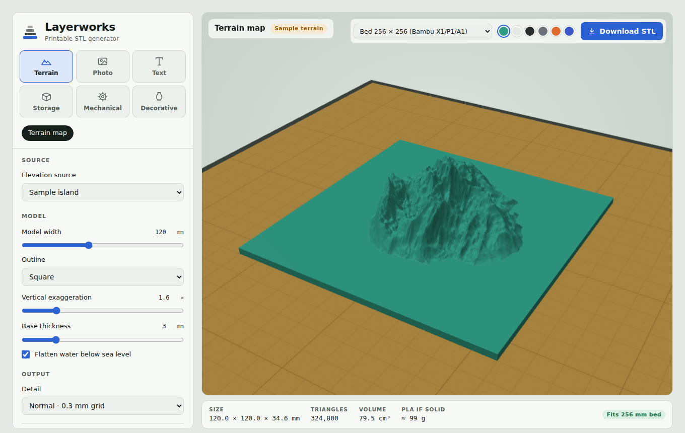
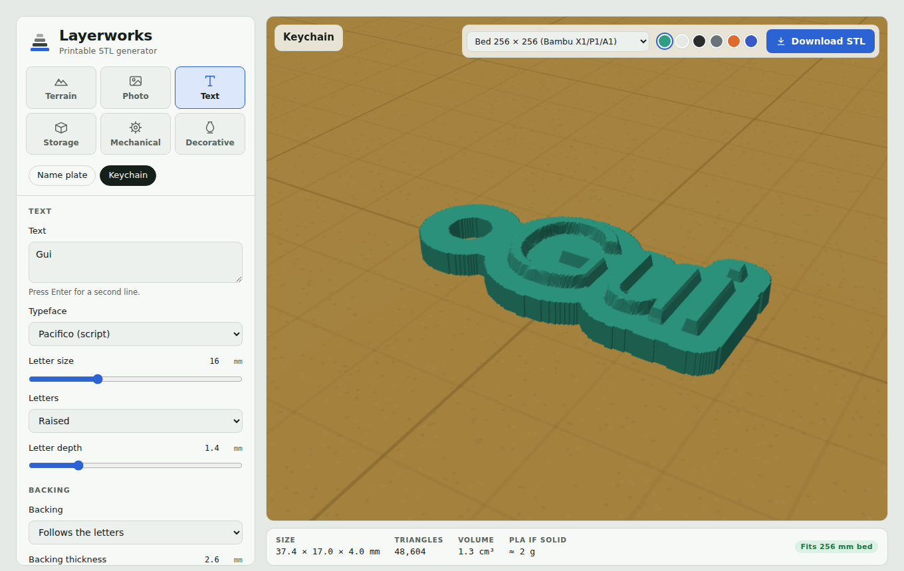
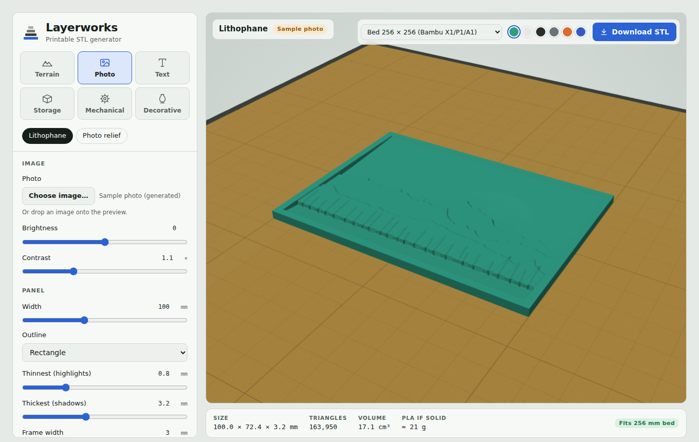

# Layerworks

Layerworks is a browser app for making 3D-printable STL files. You pick a model, set its options, check it in a live 3D preview on your printer's bed, and download the STL. There's no install and no server. Everything runs in one HTML file.



## What it makes

| Category | Models | Highlights |
|---|---|---|
| **Terrain** | Terrain map | Search a place or type latitude and longitude. Set the area (km), width (mm), outline (square, circle or hexagon), vertical exaggeration and base thickness. You can also upload a heightmap image (grayscale or Terrarium RGB). |
| **Photo** | Lithophane, Photo relief | Flat or curved lithophanes (up to 180°) with a frame, and reliefs where brightness sets the height. Drop any photo onto the preview. |
| **Text** | Name plate, Keychain | 6 typefaces, raised or engraved letters, a plate or outline backing, a keyring loop, screw holes and a border. Shows the Z height for a filament swap. |
| **Storage** | Box with lid, Round canister, Pegboard hook | Dividers, lid clearance, round/hex/octagon canisters, and hooks for 1 in./38 mm/50 mm pegboards. |
| **Mechanical** | Spur gear, Spacers, L-bracket | Involute gears (module, teeth, pressure angle, backlash, D-flat bore, hub), batches of spacers, brackets with holes and gussets. |
| **Decorative** | Vase, Pattern coaster | Twist, ripples and polygon cross-sections, solid for vase mode or walled. Honeycomb/wave/ring/lattice coasters. |

The status bar shows the model's size, triangle count, volume, roughly how much PLA it would use, and whether it fits the selected bed (256³, MK4, Ender 3, 180³, 350³).

<p>
  
  
</p>

## Use it

- **Online:** turn on GitHub Pages for this repository (Settings → Pages → Deploy from branch → `main` / root). The app will be at `https://<your-user>.github.io/<repo>/`.
- **Offline:** download the whole repo (or at least `index.html` and the `vendor/` folder next to it) and open `index.html` in Chrome, Edge or Firefox.

The 3D library (three.js) is vendored in `vendor/` rather than loaded from a CDN, so the app works even when a browser or network blocks third-party script hosts. Only two things need the internet: place search (OpenStreetMap Nominatim, with Photon as a fallback) and elevation tiles (the public [Terrarium tiles](https://registry.opendata.aws/terrain-tiles/) on AWS). Everything else — every generator, the 3D preview, STL export — works fully offline.

## Develop

The source lives in `src/`. `index.html` is built from it.

```bash
npm install        # installs three.js for the tests
npm run build      # src/ → index.html
npm test           # builds every parametric model and checks each mesh is closed
```

| File | Contents |
|---|---|
| `src/page.html` | Markup and styles |
| `src/core.js` | Geometry: heightfield solids, involute gears, vases, STL and ZIP writers (no DOM) |
| `src/models.js` | Model catalogue, parameters and build functions |
| `src/app.js` | three.js viewport, controls and downloads |
| `vendor/` | three.js and OrbitControls, vendored so the app doesn't depend on a CDN |

Every mesh is exported as one or more closed shells, meaning each edge is shared by exactly two faces with opposite winding. Parametric parts are exported as overlapping shells, which slicers merge on import.

## License

MIT. See [LICENSE](LICENSE).
